# Hierarchical Bookmark Retrieval for LLMs

A spec and simulation for improving context retrieval in long AI conversations.

## The Problem

Long conversations with LLMs degrade. The AI forgets what you told it 50 messages ago. You repeat yourself. It loses track of decisions you made together. Context windows fill up with noise instead of signal.

## How It Works

```mermaid
flowchart LR
    subgraph Hierarchical Bookmark Retrieval
        D[Query] --> E[Search bookmarks first]
        E --> F{Found relevant?}
        F -->|Yes| G[Expand to source chunks]
        F -->|No| H[Fall back to standard RAG]
        G --> I[Return high-signal context]
        H --> I
    end
```





## The Idea

Instead of treating all conversation history equally, periodically generate **bookmarks**—LLM-judged summaries of what actually mattered:

- Key conclusions and decisions
- Corrections (what the *right* understanding turned out to be)
- Validated moments ("yes, exactly")
- Foundational context the user provided

When retrieving context for a new query, search bookmarks first, then fall back to standard similarity search.

## Try the Simulation

```bash
python simulate.py
```

No dependencies required. The simulation demonstrates the core concept using mock data and rule-based scoring:

```
Average performance across all queries:
  Method                    Avg F1
  ----------------------------------------
  Standard Similarity       0.19
  Recency Weighted          0.12
  Hierarchical Bookmarks    0.56   ← 3x better
```

The bookmark system finds relevant content 3x more often than baseline approaches because it pre-identifies what mattered during the bookmark generation phase.

## What's in the Spec

- **Data structures** for bookmarks and conversation chunks
- **Trigger logic** (when to generate bookmarks)
- **Bookmark generation** via single LLM pass
- **Hierarchical retrieval** algorithm
- **Validation strategy** with explicit decision gates
- **Cost analysis** and break-even conditions

## Key Design Choices

**Lazy, not eager.** No per-message processing. Bookmarks are generated at refresh time (manual trigger or threshold).

**Validation-first.** The spec includes a baseline test: if simple recency-weighting performs within 10% of the bookmark system, don't build it. Kill the project early if it's not worth the complexity.

**Honest about scope.** This helps power users with long working sessions. It doesn't matter for short conversations or casual Q&A.

## When to Build This

- Long conversations (50+ messages) are common in your product
- Users visibly repeat themselves or say "as I mentioned"
- You already have RAG infrastructure

## When NOT to Build This

- Most conversations are short
- Simple recency weighting is "good enough"
- Engineering time is better spent elsewhere

## Files

| File | Description |
|------|-------------|
| `simulate.py` | Working demo — run this first |
| `hierarchical_bookmark_retrieval_spec_v2.md` | Full technical spec |

## Future Direction (v3)

Exploring stacking [Contextual Retrieval](https://www.anthropic.com/news/contextual-retrieval) underneath the bookmark layer—judge importance at summarization time so you never need a full-conversation scan. Two layers of compression.

## Background

I wrote this with no ML engineering experience, using AI (Claude) to critique and refine it through multiple versions. The simulation exists because someone correctly pointed out that a spec without code is easy to ignore.

**I'm looking for feedback:**
- What's naive?
- What's already been done better?
- What's missing?
- Would you actually build this?

If you work on RAG, memory systems, or LLM infrastructure, I'd appreciate your eyes on it.

## License

[CC BY 4.0](https://creativecommons.org/licenses/by/4.0/) — use it however you want, just give credit.

## Contact

Open an issue or reach out if you have thoughts.
